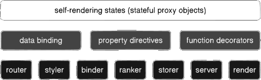

<script src='../index.js'></script>
<style>
@import url(./index.css);
@import url(./conception.css);
</style> 

# Conception

Reactful framework wain mainly designed to evolve the way that stateful React development is realized with new concepts, capabilities and resources. 



## Self-rendering

Stateful Proxy Object (SRO) is a self-rendering state that renders when it is changed, cutting all boilerplate code with class components,  hooks, imports, setState calls, etc.


In Reactful, props are transformed in local stateful object, triggering the render each props change. It also supports global and partial states (see Data binding section).

```ts
const Hello = props => <>
   <h1>Hello {props.name ?? 'world'}! </h1>
   <input value={props.name} onClick={e => 
          props.name = e.target.value} />
<>
```

## Data binding

Self-rendering states enable data binding with new global framework props, where `[data]`  receives the object and the `[binds]` maps its fields.

```ts
const Hello = props => <>
   <h1>Hello {props.name ?? 'world'}! </h1>
   <input data={props} bind='name' />
<>
```

## Props directives

Data binding is enabled by props directives, a injectable global props that works in similar way to Angular attributes directives, with a new IoC container for React.

```ts
const hide = props => ({...props, hidden:true })

server().inject(hide).render() // injected directive

const Sample = props => <div hide>Double zoom<div/>
```

## Function decorators

Native decorators just work with classes, being useless to the functional React world. Reactful design a function decator transpiler, enabling function decorators.

```ts
@server('static') const About = props => <>...</>
```